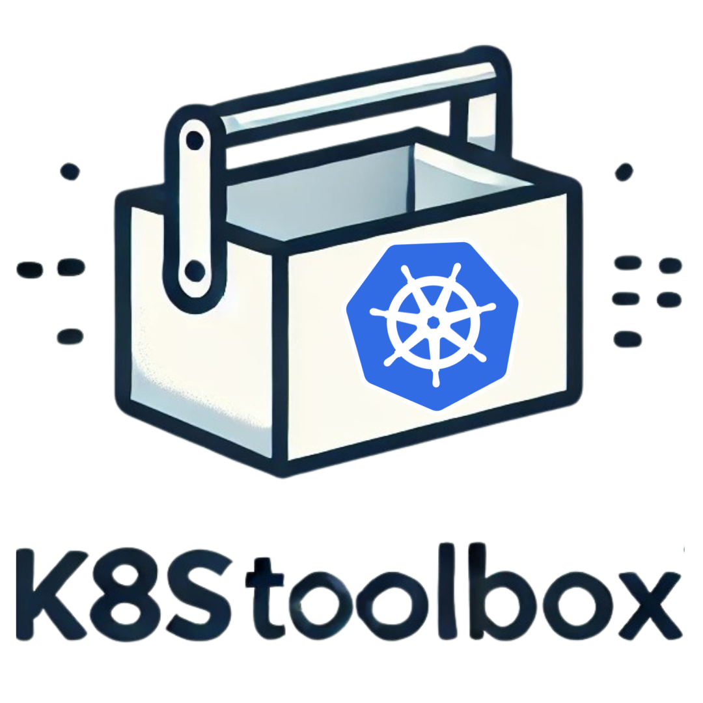

[](https://github.com/narmidm/K8sToolbox/actions/workflows/ci.yml)
[](https://github.com/narmidm/K8sToolbox/actions/workflows/cd.yml)
[](https://hub.docker.com/repository/docker/narmidm/k8stoolbox)
[](https://hub.docker.com/repository/docker/narmidm/k8stoolbox)
[](https://raw.githubusercontent.com/narmidm/K8sToolbox/refs/heads/master/go.mod)
[](https://raw.githubusercontent.com/narmidm/K8sToolbox/refs/heads/master/LICENSE)
[](https://goreportcard.com/report/github.com/narmidm/K8sToolbox)

[](https://github.com/narmidm/K8sToolbox/issues)
[](https://github.com/narmidm/K8sToolbox/stargazers)
[](https://github.com/narmidm/K8sToolbox/forks)
[](https://github.com/narmidm/K8sToolbox/commits/master/)

### Connect with me
[](https://x.com/intent/user?screen_name=that_imran)
<a href="https://www.linkedin.com/comm/mynetwork/discovery-see-all?usecase=PEOPLE_FOLLOWS&followMember=narmidm" target="blank"></a>

# K8sToolbox


**K8sToolbox** is a versatile toolkit designed for managing Kubernetes clusters, providing essential debugging tools and utilities for cluster administrators and developers.

## Overview

**K8sToolbox** is an all-in-one, versatile toolkit engineered to streamline the management and troubleshooting of Kubernetes clusters. It serves as a one-stop solution for all Kubernetes management and troubleshooting needs, providing everything required to maintain and optimize your cluster environments. It provides a comprehensive suite of powerful debugging, diagnostic, and operational tools designed specifically for cluster administrators, DevOps engineers, and developers. With K8sToolbox, users gain the ability to efficiently manage workloads, diagnose issues, and maintain optimal performance of Kubernetes environments.

Equipped with a rich collection of utilities that include advanced network diagnostics, automated health checks, resource monitoring, and recovery mechanisms, K8sToolbox empowers teams to proactively identify and resolve cluster-related challenges. Whether you need to aggregate logs, test pod connectivity, manage resources, or troubleshoot network policies, K8sToolbox offers a unified solution that significantly reduces complexity while enhancing productivity.

**K8sToolbox** integrates essential third-party utilities like `kubectl`, `stern`, `k9s`, and `mc` (MinIO Client), providing a seamless, command-driven experience for interacting with Kubernetes clusters. This toolkit not only simplifies debugging processes but also provides the scalability and robustness necessary to maintain large-scale, multi-node environments effectively. By combining a vast array of capabilities into a single, easy-to-use image, K8sToolbox ensures that Kubernetes management is more accessible, efficient, and reliable than ever before.

## Key Features

### Core Functionality
- **CLI Tools**: Rich command-line interface with multiple commands for different operations
- **Scripting Capabilities**: Extensive shell script collection for common Kubernetes tasks
- **Diagnostic Tools**: Advanced tools for troubleshooting network, resources, and cluster issues

### Enhanced Monitoring
- **Prometheus Integration**: Built-in Prometheus metrics endpoint for monitoring K8sToolbox operations
- **Resource Metrics**: CPU, memory, and other resource metrics collection
- **Health Metrics**: Pod, service, and node health status tracking
- **Connectivity Metrics**: Network connectivity check results

### Web UI
- **Dashboard**: Interactive web dashboard showing cluster status at a glance
- **Pod Management**: View, search, and manage pods from the web interface
- **Service & Node Visualization**: Graphical representation of services and nodes
- **Live Updates**: Real-time updates of cluster state
- **Mobile Responsive**: Works on desktops, tablets, and mobile devices

### Authentication & Security
- **Basic Auth**: Username/password protection for the web interface
- **Secret Management**: Secure storage of credentials in Kubernetes secrets
- **Least Privilege**: Default deployment with minimal required permissions
- **Security Guidelines**: Comprehensive documentation on secure deployment

### Observability Platform Integration
- **Grafana Dashboard**: Pre-built Grafana dashboard for K8sToolbox metrics
- **ServiceMonitor**: Prometheus Operator integration through ServiceMonitor CRD
- **Structured Logging**: JSON-formatted logs for easy integration with log aggregators
- **Metrics Retention**: Historical metrics storage for trend analysis

**Tools included**: 
``curl, iproute2, iputils, netcat-openbsd, tcpdump, bind-tools, traceroute, iperf3, jq, strace, htop, iftop, net-tools, rsync, openssl, gpg, vim, nano, busybox-extras, mariadb-client, postgresql-client, redis, mongodb-tools, helm, socat, ncdu, bash, ca-certificates, conntrack-tools, ethtool, iptables, less, mtr, openssh-client, psmisc, tcptraceroute, ngrep, yq, kubectl, stern, k9s, mc, nmap, screen, tmux``

## Use Cases
**K8sToolbox** is perfect for:
- **Cluster Troubleshooting**: Quickly diagnose issues in your cluster, such as resource contention, network issues, or failed pods.
- **Maintenance**: Clean up stale or unused resources like completed jobs and old replicasets to keep your cluster healthy.
- **Automation**: Automate tasks like scaling deployments, resource usage checks, and more.
- **Debugging Network Policies**: Validate network connectivity and ensure your network policies are properly configured.
- **Log Aggregation**: Collect and analyze logs from multiple namespaces and pods to understand the state of your cluster and applications.
- **Real-time Monitoring**: Monitor your cluster's health and performance in real-time via the web UI or Prometheus metrics.

With **K8sToolbox**, you can:
- Execute health checks, manage stuck resources, aggregate logs, and perform network diagnostics.
- Run custom scripts directly from your local machine or inside a Kubernetes pod using shell exec. **"For detailed usage instructions on the scripts, please refer to [Using K8sToolbox Scripts](#using-k8stoolbox-scripts)."**
- Monitor your cluster through the intuitive web UI or integrate with your existing observability platform.

## Folder Structure
```
K8sToolbox/
│
├── docker/
│   └── Dockerfile              # Docker image definition for building K8sToolbox
│
├── manifests/
│   ├── debug-daemon.yaml       # DaemonSet manifest for deploying K8sToolbox on all nodes
│   └── debug-pod.yaml          # Pod manifest for running a standalone K8sToolbox instance
│
├── scripts/                    # Collection of helpful Kubernetes management scripts
│   ├── aggregate_logs.sh
│   ├── auto_recover.sh
│   ├── auto_scaling.sh
│   ├── backup_restore.sh
│   ├── clean_stale_resources.sh
│   ├── connectivity_test.sh
│   ├── delete_stuck_crds.sh
│   ├── delete_stuck_namespace.sh
│   ├── healthcheck.sh
│   ├── network_diag.sh
│   ├── resource_usage.sh
│   ├── restart_failed_pods.sh
│   ├── snapshot_audit.sh
│   └── test_network_policy.sh
│
├── ui/
│   └── static/                 # Web UI static files
│       └── index.html          # Main web interface HTML file
│
├── charts/
│   └── k8stoolbox/             # Helm chart for K8sToolbox
│       ├── Chart.yaml          # Chart metadata
│       ├── values.yaml         # Configurable values
│       ├── templates/          # Helm templates
│       └── dashboards/         # Grafana dashboards
│
├── .gitignore
├── CONTRIBUTING.md             # Guidelines for contributing to K8sToolbox
├── LICENSE                     # License details (Apache License 2.0)
├── go.mod                      # Go module definition
├── main.go                     # Main Golang utility file for K8sToolbox
├── README.md                   # Documentation (you're reading this!)
└── SECURITY_BEST_PRACTICES.md  # Security guidelines for deployment
```

## Getting Started
### Prerequisites
- **Docker** installed to build and run the K8sToolbox Docker image.
- **Kubernetes cluster** with `kubectl` configured to interact with the cluster.
- **Permissions**: Ensure you have sufficient permissions to run commands like `kubectl exec` and `kubectl apply`.

### Building the Docker Image
To build the Docker image for **K8sToolbox**, run the following command in the root directory of the project:

```sh
docker build -t k8stoolbox:latest -f docker/Dockerfile .
```

This will create a Docker image named `k8stoolbox` that you can use locally or push to a container registry.

### Deploying K8sToolbox in Kubernetes
You can deploy **K8sToolbox** as either a standalone **Pod**, as a **DaemonSet** to cover all nodes, or using the **Helm chart** for advanced configuration.

#### Using Helm (Recommended)
To deploy K8sToolbox with Helm, which provides the most configuration options:

```sh
# Add the K8sToolbox Helm repository
helm repo add k8stoolbox https://narmidm.github.io/K8sToolbox/charts

# Update repositories
helm repo update

# Install K8sToolbox with default values
helm install k8stoolbox k8stoolbox/k8stoolbox

# Or install with custom values
helm install k8stoolbox k8stoolbox/k8stoolbox -f my-values.yaml
```

#### Standalone Pod
To deploy a standalone **K8sToolbox** pod, use the following command:

```sh
kubectl apply -f https://raw.githubusercontent.com/narmidm/K8sToolbox/refs/heads/master/manifests/debug-pod.yaml
```

This creates a pod named `k8stoolbox-debug` in the `default` namespace, which can be used for one-off debugging and troubleshooting tasks.

#### DaemonSet
To deploy **K8sToolbox** on all nodes, use the DaemonSet manifest:

```sh
kubectl apply -f https://raw.githubusercontent.com/narmidm/K8sToolbox/refs/heads/master/manifests/debug-daemon.yaml
```

This creates a **DaemonSet** that runs **K8sToolbox** on all nodes, making it accessible from anywhere in the cluster.

### Accessing the Web UI
Once deployed, you can access the K8sToolbox Web UI by port-forwarding:

```sh
kubectl port-forward svc/k8stoolbox 8080:8080
```

Then open your browser and navigate to `http://localhost:8080`. If authentication is enabled, use the credentials from your configuration, or the default:
- Username: admin
- Password: Password123

### Accessing Prometheus Metrics
K8sToolbox exposes Prometheus metrics at the `/metrics` endpoint. To access:

```sh
kubectl port-forward svc/k8stoolbox 9090:9090
```

Then open your browser and navigate to `http://localhost:9090/metrics`.

### Using Grafana Dashboards
K8sToolbox provides pre-built Grafana dashboards. If you have Grafana installed with the Grafana Operator:

```sh
kubectl apply -f charts/k8stoolbox/dashboards/k8stoolbox-dashboard.json
```

Or manually import the dashboard JSON from `charts/k8stoolbox/dashboards/k8stoolbox-dashboard.json` into your Grafana instance.

### Utilizing K8sToolbox
There are three primary ways to use **K8sToolbox**:
1. **Web UI**: Access the web interface for graphical monitoring and management
2. **Local Execution**: Running scripts directly from the local system
3. **Kubernetes Shell Execution**: Executing commands inside a running **K8sToolbox** pod using `kubectl exec`

#### 1. Using the Web UI
The web interface provides an intuitive way to:
- View cluster health at a glance
- Monitor pods, services, and nodes
- Execute health checks and diagnostics
- View resource usage metrics
- Test connectivity between services

#### 2. Running Scripts Locally
You can run the scripts in the `/scripts` directory locally if you have **kubectl** configured and connected to your Kubernetes cluster.
**"For detailed usage instructions on the scripts, please refer to [Using K8sToolbox Scripts](#using-k8stoolbox-scripts)."**


Examples:

- **Backup and Restore Resources**:
  ```sh
  ./scripts/backup_restore.sh backup default
  ./scripts/backup_restore.sh restore default
  ```
- **Clean Stale Resources**:
  ```sh
  ./scripts/clean_stale_resources.sh default
  ```
- **Test Network Policies**:
  ```sh
  ./scripts/test_network_policy.sh default <source_pod> <target_pod>
  ```
- **Aggregate Logs**:
  ```sh
  ./scripts/aggregate_logs.sh default kube-system
  ```

#### 3. Running Scripts in Kubernetes Pods
You can also execute the scripts inside a running **K8sToolbox** pod by using **kubectl exec**. This is useful when you need to troubleshoot issues within the cluster itself.

First, find the name of the **K8sToolbox** pod:

```sh
kubectl get pods -n default -l app=k8stoolbox
```

Then use `kubectl exec` to run commands:

- **Execute a Health Check**:
  ```sh
  kubectl exec -it <k8stoolbox-pod-name> -- /usr/local/bin/healthcheck default
  ```
- **Run Resource Cleanup**:
  ```sh
  kubectl exec -it <k8stoolbox-pod-name> -- /usr/local/bin/clean_stale_resources default
  ```
- **Ping Between Pods to Test Network Policy**:
  ```sh
  kubectl exec -it <k8stoolbox-pod-name> -- /usr/local/bin/test_network_policy default <source_pod> <target_pod>
  ```

### Available Scripts
The `/scripts` directory contains several useful scripts for Kubernetes management:

- **aggregate_logs.sh**: Aggregates logs from all pods in specified namespaces.
- **auto_recover.sh**: Automatically recovers failed pods and sends alerts.
- **auto_scaling.sh**: Automatically scales deployments based on resource usage.
- **backup_restore.sh**: Backs up and restores Kubernetes resources in a specified namespace.
- **clean_stale_resources.sh**: Cleans up completed jobs, old replicasets, and orphaned persistent volumes.
- **connectivity_test.sh**: Tests network connectivity between pods or services.
- **delete_stuck_crds.sh**: Deletes CRDs that are stuck by removing finalizers.
- **delete_stuck_namespace.sh**: Deletes namespaces that are stuck due to finalizers.
- **healthcheck.sh**: Performs health checks on pods and nodes in a namespace.
- **network_diag.sh**: Provides advanced network diagnostics, including capturing traffic.
- **resource_usage.sh**: Monitors CPU and memory usage for nodes and pods.
- **restart_failed_pods.sh**: Restarts all failed pods in a given namespace.
- **snapshot_audit.sh**: Takes a snapshot of the cluster state for auditing purposes.
- **test_network_policy.sh**: Tests network connectivity between pods to validate network policies.

### Symlinked Commands
For convenience, all scripts are symlinked to `/usr/local/bin` in the Docker image, allowing you to call them without specifying the full path. For example:

```sh
auto_recover
backup_restore backup default
clean_stale_resources default
```

## Advanced Configuration

### Environment Variables
K8sToolbox can be configured using the following environment variables:

| Variable | Default | Description |
|----------|---------|-------------|
| ENABLE_WEB_UI | false | Enable the web UI |
| WEB_UI_PORT | 8080 | Port for the web UI |
| ENABLE_AUTH | true | Enable authentication for the web UI |
| AUTH_USERNAME | admin | Username for basic authentication |
| AUTH_PASSWORD | | Password for basic authentication |
| ENABLE_PROMETHEUS | false | Enable Prometheus metrics endpoint |
| PROMETHEUS_PORT | 9090 | Port for Prometheus metrics |
| LOG_LEVEL | info | Logging level (debug, info, warn, error) |
| LOG_FORMAT | text | Log format (text, json) |
| DEFAULT_TIMEOUT | 30 | Default timeout in seconds for operations |

### Helm Values
When deploying with Helm, you can customize the configuration using values:

```yaml
# Enable the web UI
config:
  enableWebUI: true
  webUIPort: 8080

# Configure authentication
auth:
  enabled: true
  username: admin
  generatePassword: true

# Enable Prometheus metrics
monitoring:
  enablePrometheus: true
  metricsPort: 9090
  createServiceMonitor: true
  
# Configure security
security:
  useRestrictedPermissions: true
  podSecurityContext:
    runAsNonRoot: true
    runAsUser: 10001
  containerSecurityContext:
    privileged: false
```

See the [values.yaml](charts/k8stoolbox/values.yaml) file for all available configuration options.

## Using K8sToolbox Scripts

This section provides detailed information on the various utility scripts available in the `K8sToolbox` repository, located under the `/scripts` directory. Each script has been crafted to assist with common Kubernetes cluster management and troubleshooting tasks. Below, you will find how to use each script, including commands to run them directly or through the symlinks set up during installation.

To learn how to use these scripts, follow the instructions provided for each script below. You can execute these commands from your local machine or within a Kubernetes pod, depending on your setup.

### Running the Scripts Locally
If you have cloned the repository and have `kubectl` configured to interact with your cluster, you can run the scripts directly by using:

```sh
./scripts/<script_name>.sh [arguments]
```

Alternatively, you can use the symlinks created for each script, allowing you to run them without specifying the full path:

```sh
<script_name> [arguments]
```

Ensure that your shell environment includes `/usr/local/bin` in the `$PATH` so that the symlinks are accessible.

### Script Details
Below is a list of all available scripts, with detailed descriptions and examples of how to use them:

1. **aggregate_logs.sh**  
   Aggregates logs from all pods within a specified namespace. This script is useful when you need a combined view of application logs.
   ```sh
   aggregate_logs <namespace>
   ```
   Example:
   ```sh
   aggregate_logs default
   ```
   This command will aggregate logs from all pods in the `default` namespace and print them to the console.

2. **auto_recover.sh**  
   Automatically recovers failed pods and restarts them as needed. This script can be run to automate pod recovery.
   ```sh
   auto_recover <namespace>
   ```
   Example:
   ```sh
   auto_recover kube-system
   ```
   This command will automatically recover any failed pods in the `kube-system` namespace by restarting them.

3. **auto_scaling.sh**  
   Adjusts deployment scaling based on resource usage. This script can help automate horizontal scaling.
   ```sh
   auto_scaling <namespace> <deployment_name> <desired_replicas>
   ```
   Example:
   ```sh
   auto_scaling default my-app 5
   ```
   This command will scale the deployment named `my-app` in the `default` namespace to `5` replicas.

4. **backup_restore.sh**  
   Backs up and restores Kubernetes resources in a namespace. Useful for disaster recovery scenarios.
   ```sh
   backup_restore backup <namespace>
   backup_restore restore <namespace>
   ```
   Example:
   ```sh
   backup_restore backup default
   ```
   This command will back up all resources in the `default` namespace. Use `restore` instead of `backup` to restore the resources.

5. **clean_stale_resources.sh**  
   Cleans up old Kubernetes resources such as completed jobs and replicasets.
   ```sh
   clean_stale_resources <namespace>
   ```
   Example:
   ```sh
   clean_stale_resources default
   ```
   This command will clean up stale resources (e.g., completed jobs, old replicasets) in the `default` namespace.

6. **connectivity_test.sh**  
   Tests network connectivity between two pods. Useful for validating network policies.
   ```sh
   connectivity_test <namespace> <source_pod> <target_pod>
   ```
   Example:
   ```sh
   connectivity_test default pod-a pod-b
   ```
   This command will test network connectivity from `pod-a` to `pod-b` in the `default` namespace.

7. **delete_stuck_crds.sh**  
   Deletes Custom Resource Definitions (CRDs) that are stuck due to finalizers.
   ```sh
   delete_stuck_crds <crd_name>
   ```
   Example:
   ```sh
   delete_stuck_crds my-crd
   ```
   This command will forcefully delete the CRD named `my-crd` that is stuck due to finalizers.

8. **delete_stuck_namespace.sh**  
   Deletes namespaces that are stuck in terminating status.
   ```sh
   delete_stuck_namespace <namespace>
   ```
   Example:
   ```sh
   delete_stuck_namespace default
   ```
   This command will delete the `default` namespace if it is stuck in a terminating state.

9. **healthcheck.sh**  
   Performs health checks on all pods within a namespace.
   ```sh
   healthcheck <namespace>
   ```
   Example:
   ```sh
   healthcheck kube-system
   ```
   This command will perform health checks on all pods in the `kube-system` namespace and report any issues found.

10. **network_diag.sh**  
    Provides advanced network diagnostics, including traffic capture between pods.
    ```sh
    network_diag <namespace> <source_pod> <target_pod>
    ```
    Example:
    ```sh
    network_diag default pod-a pod-b
    ```
    This command will perform network diagnostics between `pod-a` and `pod-b` in the `default` namespace, including capturing traffic if needed.

11. **resource_usage.sh**  
    Monitors CPU and memory usage for nodes and pods within a namespace.
    ```sh
    resource_usage <namespace>
    ```
    Example:
    ```sh
    resource_usage default
    ```
    This command will monitor and display the CPU and memory usage for all nodes and pods in the `default` namespace.

12. **restart_failed_pods.sh**  
    Restarts all failed pods in a given namespace.
    ```sh
    restart_failed_pods <namespace>
    ```
    Example:
    ```sh
    restart_failed_pods kube-system
    ```
    This command will restart all failed pods in the `kube-system` namespace.

13. **snapshot_audit.sh**  
    Takes a snapshot of the cluster state for auditing purposes.
    ```sh
    snapshot_audit <namespace>
    ```
    Example:
    ```sh
    snapshot_audit default
    ```
    This command will take a snapshot of the cluster state for the `default` namespace, which can be used for auditing purposes.

14. **test_network_policy.sh**  
    Tests network policies by attempting connections between source and target pods.
    ```sh
    test_network_policy <namespace> <source_pod> <target_pod>
    ```
    Example:
    ```sh
    test_network_policy default pod-a pod-b
    ```
    This command will test the network policies by attempting to connect from `pod-a` to `pod-b` in the `default` namespace.

## Security Considerations

K8sToolbox is designed with security in mind, but it's important to properly configure it for your environment. Please review the [SECURITY_BEST_PRACTICES.md](SECURITY_BEST_PRACTICES.md) file for comprehensive security guidelines.

Key security considerations:
- Use least privilege RBAC permissions (default in Helm chart)
- Run containers as non-root users (default in Helm chart)
- Enable authentication for the web UI
- Avoid mounting the host root filesystem unless necessary
- Apply network policies to restrict pod communication

## Contributing
We welcome contributions! Please read the [CONTRIBUTING.md](CONTRIBUTING.md) file for guidelines on how to contribute to **K8sToolbox**.

### License
This project is licensed under the Apache License 2.0 - see the [LICENSE](LICENSE) file for details.

### Authors and Acknowledgements
K8sToolbox was inspired by various Kubernetes utility tools, including the **Swiss Army Knife** for DevOps. Special thanks to all contributors who helped improve this toolbox.

### Future Work
- **Enhanced AI integration** for automated diagnostics and remediation
- **Extended platform integrations** for monitoring and observability
- **Custom plugin system** for extending functionality
- **Web terminal access** for direct command execution from the UI

## Inspiration
K8sToolbox was inspired by the [swiss-army-knife](https://github.com/leodotcloud/swiss-army-knife) repository, which serves as a useful multi-purpose tool for DevOps. Our goal is to build upon that foundation and create a specialized, Kubernetes-focused toolkit that helps users effectively troubleshoot and manage their clusters.

Let us know if you have feature requests or suggestions to make **K8sToolbox** even better!
